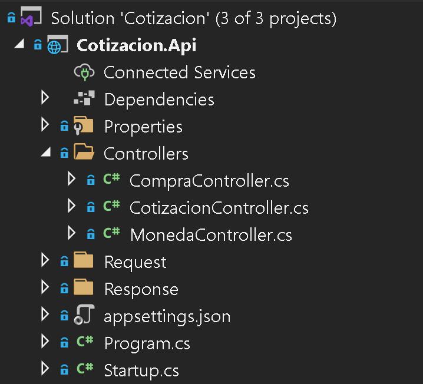
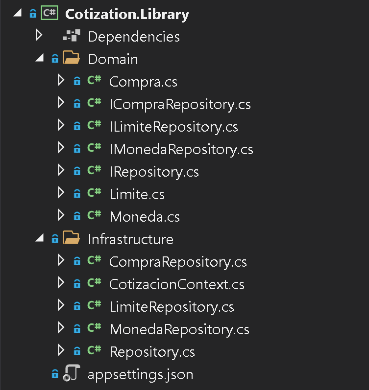
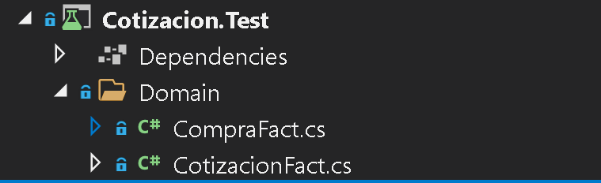
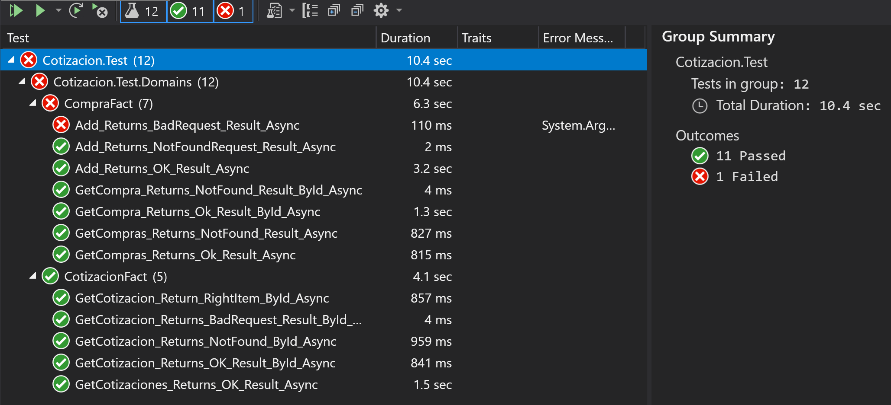
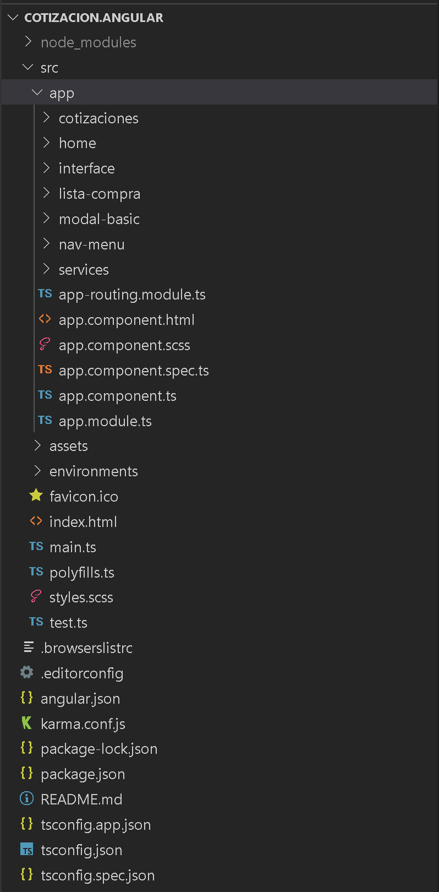
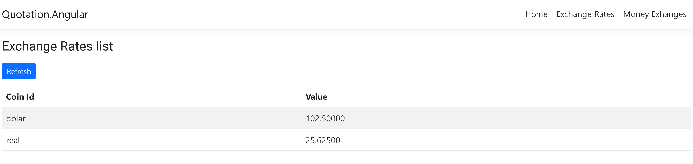
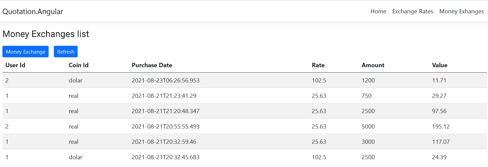
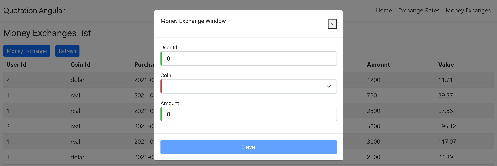

## A continuación detallo brevemente el trabajao realizado.

La solución lleva por nombre **“Cotizacion”.**

Está compuesta por cuatro proyectos:

- #### Cotización. Api
  - Este es el Web Api y contiene todos los métodos para suplir las peticiones que se realizan desde el front end a traves de los verbos HTTP GET y HTTP POST, para ello interactuando con la base de datos.

Esta es la estructura de folder de dicho proyeto
```sh
||
| :- |
```

- **Cotizacion.Library**
  - Contiene toda la lógica de negocio haciendo uso de las entidades, contexto de base de datos y repositorio vía Entity Framework Core para suplir los datos al Web Api. La data se almacena en Sql Server.

Esta la estructura de folder de dicho proyecto	

||
| :- |

- **Cotizacion.Test**
  - Contiene las pruebas unitarias para probar la funcionalidad tanto del proyecto Web Api como de la libraría de clase que suple los datos desde la base de datos. Este proyecto realiza las pruebas invocando los controladores del Web Api apoyandose el uno varios repositorios para obtener los datos.
  - Para realizar las prueba utilizo una base de dato en memoria (InMemory database) haciendo uso del contexto y las entidades del proyecto Cotizacion.Library.

Esta la estructura de folder de dicho proyecto

||
| :- |

Esta es una muestra de las corridas de los test

||
| :- |

**

- **Cotizacion.Angular**
  - Esta proyecto es el frond end desde donde el usario interactuaría con la data. El mismo  accede a los métodos del Web Api tanto para obtener la cotización de la moneda diaría como la compra o el exchange de una moneda local a exranjera.

Esta es la estructura de folder de dicho proyecto

||
| :- |

**

**A continuación explicación de las pantallas de la solución en angular.** 


Esta es la home page, se consigue por defecto al arrancar la solución y también pulsando sobre el enlace o menú *Home* de la parte superior izquierda.



En esta página se visualiza la tasa de cambio del día para monedas extranjeras. Esta página se consigue al pulsar sobre el enlace o menú *Exchange Rates* en la parte superior izquierda, antes de presentar los datos sale el *loading wheel*. El botón *refresh* actualiza la información en pantalla consultando nuevamente el servicio externo que brinda dicha información.



Esta página muestra un histórico de las compras realizada de moneda extranjera. Esta página sale al pulsar sobre el enlace o menú *Money Exchange* de la parte superior izquierda, antes de presentar los datos sale el loading wheel. No está filtrando por día, sino que presenta el histórico de compras ordernado de manera descendente, tampoco tiene paginación. El botón *refresh* actualiza la información en pantalla consultando nuevamente el Web Api que brinda dicha información. 



Al pulsar sobre el botón Money Exchange sale este modal para realizar una compra de moneda. Todos los campos tienen validaciones indicadas con una franja verde o roja dependiendo de si el campo está vacío o tiene data, el botó de guardar no se enciende hasta que el todos los campos tengan valor, y al guardar los cambios o producirse un error al realizar los calculos, el usario es informado en una franja que dura dos segundos.

**Configuración**

Los proyecto Cotizacion.Api y Cotizacion.Angular van acompañado de sus archivos de configuración *appsettings.json* respectivamente.

Para el proyecto Cotizacion.Api, el archivo appsettings.json se encuentra ubicado en la raíz de su carpeta o folder principal. Se debe cambiar el valor de la llave o key “Exchange” del objeto “ConnectionString” para especificar donde se encuentra la base de datos.

Para el proyecto Cotizacion.Angular, el archivo *appsettings.json* se encuentra ubicado en la ruta Cotizacion.Angular/src/assets. Se debe cambiar el valor de la llave o key “webApiHost” para especificar el nombre del dominio o host donde se encuenta alojado el Web API. Dicho nombre debe terminar con un slash “/” ya que a partir de ahí sigue el resto de cada Endpoint.

**Componentes**

Para que el proyecto Cotizacion.Angular funcione correctamente se deben instalar los siguientes componentes:

- Bootstrap.
- Jquery
- PopperJs
- Angular Material

Ya que el proyecto hace uso de los mismos para proveer el UI y UX.

**En cuanto a esta pregunta**

2a) ¿Qué opina de pasar el id de usuario como input del endpoint? ¿Cómo mejoraría la transacción para asegurarnos de que el usuario que pidió la compra es quien dice ser?

Pienso que no es viable porque se estaría fomentando el hardcoded y limitando la escalabilidad de la apliación, todo las interrogantes se solucionan con un mecanismo de autenticación donde el usuario tenga que suministrar sus credenciales antes de interactuar con la aplicación y así buscar en el base de dato su Id de usuario y guardarlo en session para pasarlo a las pantallas necesarias.


